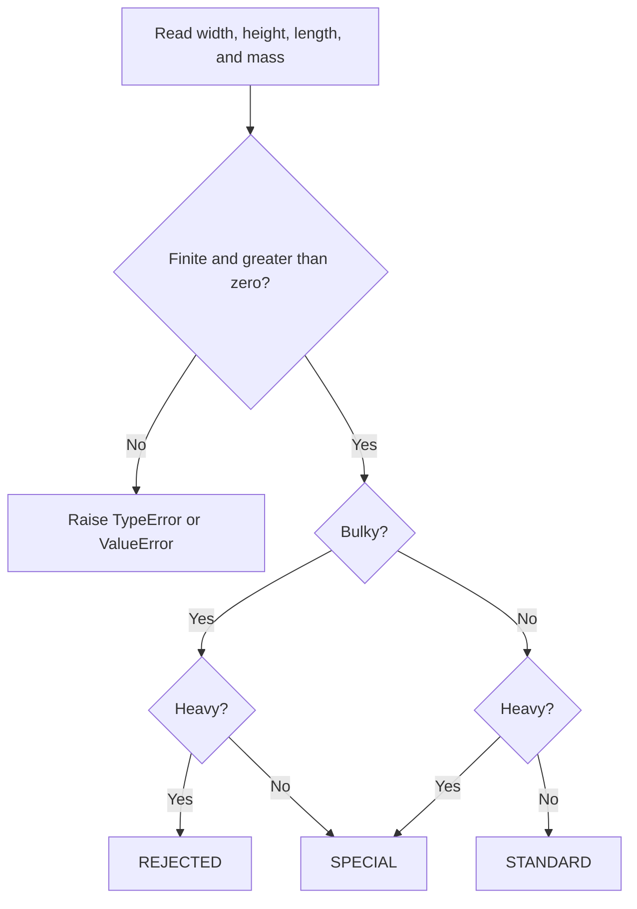

# Package Sorter

[](https://github.com/lloredia/Thoughtful-Automation-Package-Sorting-Function/actions/workflows/ci.yml)

A robotic arm dispatch function that classifies packages into three stacks from their physical dimensions and mass.

`sort(width, height, length, mass)` returns `STANDARD`, `SPECIAL`, or `REJECTED`. Dimensions are centimeters. Mass is kilograms. The function is pure: the same measurements always produce the same stack, and invalid measurements raise instead of being guessed.

## Rules

A package is **bulky** when either of these is true:

- volume (`width * height * length`) is at least **1,000,000 cm³**
- any single side is at least **150 cm**

A package is **heavy** when its mass is at least **20 kg**.

Comparisons are inclusive. A package that lands on a threshold counts as bulky or heavy.

| Bulky | Heavy | Stack |
| --- | --- | --- |
| No | No | `STANDARD` |
| Yes | No | `SPECIAL` |
| No | Yes | `SPECIAL` |
| Yes | Yes | `REJECTED` |

Bulky can come from volume, from one long side, or from both. Either cause is enough. Combined with heavy, the result is still `REJECTED`.

## Decision flow



Bulky means volume ≥ 1,000,000 cm³ or any side ≥ 150 cm. Heavy means mass ≥ 20 kg.

## Install

The package needs Python 3.11 or newer.

```bash
python -m pip install -e ".[dev]"
```

The `[dev]` extra installs pytest, coverage, Ruff, mypy, and pre-commit. Omit it for the library alone:

```bash
python -m pip install -e .
```

## Usage

### Library

```python
from package_sorter import sort

sort(10, 10, 10, 5)  # STANDARD
sort(150, 10, 10, 5)  # SPECIAL  (bulky, not heavy)
sort(10, 10, 10, 20)  # SPECIAL  (heavy, not bulky)
sort(100, 100, 100, 20)  # REJECTED (bulky and heavy)
```

Invalid measurements raise before any stack is chosen:

```python
sort(0, 10, 10, 5)  # ValueError: width must be greater than zero
sort(-1, 10, 10, 5)  # ValueError: width must be greater than zero
sort("10", 10, 10, 5)  # TypeError: width must be a number, got str
sort(float("nan"), 10, 10, 5)  # ValueError: width must be a finite number
```

### Command line

```bash
python -m package_sorter --width 10 --height 10 --length 10 --mass 5
package-sorter --width 100 --height 100 --length 100 --mass 20
```

The stack name is printed on stdout. Rejected measurements print `error: ...` on stderr and exit `1`. Unparseable arguments exit `2`.

```text
$ python -m package_sorter --width 10 --height 10 --length 10 --mass 5
STANDARD

$ python -m package_sorter --width 0 --height 10 --length 10 --mass 5
error: width must be greater than zero, got 0.0
```

## Tests

```bash
pytest
```

The suite is parametrized around the exact thresholds: volume 1,000,000 cm³, each side at 150 cm, and mass at 20 kg, including the values just below and just above those lines. It also checks invalid types and non-positive or non-finite numbers. Coverage is measured on branches and fails under 100%.

Lint, format, and types:

```bash
ruff check .
ruff format --check .
mypy
```

Install the git hooks once:

```bash
pre-commit install
pre-commit run --all-files
```

Continuous integration runs the same lint, type check, and test commands on Python 3.11, 3.12, and 3.13 for every push and pull request. The 3.13 job writes a coverage summary on the workflow run.

## Design notes

Classification and validation are separate. The bulky and heavy flags are computed first, then mapped to a stack with the truth table above. Thresholds live as named constants (`VOLUME_THRESHOLD_CM3`, `DIMENSION_THRESHOLD_CM`, `MASS_THRESHOLD_KG`) so the comparisons stay readable.

The public signature is unchanged: `sort(width, height, length, mass) -> str`, and the three stack names are plain strings. The package lives under `src/package_sorter` and ships a `py.typed` marker.

Validation is stricter than the first script in this repository:

- **Zero is rejected.** A side of length 0 used to produce volume 0 and fall through as not bulky, so `sort(0, 0, 0, 0)` returned `STANDARD`. A zero dimension or mass is not a dispatchable measurement, so it now raises `ValueError`. The bulky and heavy thresholds themselves are unchanged.
- **Non-finite floats are rejected.** Every comparison with `NaN` is false, so a `NaN` measurement used to classify as `STANDARD`. Infinities used to count as bulky or heavy. Both now raise `ValueError`.
- **Booleans are rejected.** `bool` is a subclass of `int`, so `True` used to pass the numeric check and count as `1`. Booleans now raise `TypeError`.
- **Large integers stay integers.** Finiteness is checked only for floats. `math.isfinite` converts through `float` and raises `OverflowError` for integers outside the float range, even though those integers are finite. A very long integer side is still bulky.

Strings are not coerced. `"10"` is a type error, not a width of 10 cm.

## Layout

```text
src/package_sorter/    library, CLI, and module entry point
tests/                 pytest suite
pyproject.toml         package metadata, Ruff, mypy, pytest, coverage
.pre-commit-config.yaml
.github/workflows/ci.yml
```

## License

MIT. See [LICENSE](LICENSE).
